  

<!-- ══════════ HIRE CTA — ABOVE THE FOLD ══════════ -->

  

### **Need someone to own your backend end to end?**

&nbsp;

&nbsp;

 

<a href="https://medium.com/@h4ck3raditya">Medium</a> ·
<a href="https://www.leetcode.com/adityajain_cse">LeetCode</a> ·

## 🎯 What I Do For You

I take a business problem and hand back a system that runs in production — architecture, code, infrastructure, and the boring reliability work nobody wants to do.

| I Build | You Get |
|:---|:---|
| **Multi-tenant SaaS platforms** | One codebase serving many customers with hard data isolation |
| **Regulated-domain systems** | Compliance designed into the schema, not bolted on before an audit |
| **Business automation** | WhatsApp, CRM, payments, workflows — running while you sleep |
| **Cloud infrastructure** | Dockerized, reverse-proxied, CI/CD, monitored, rollback-ready |
| **Architecture rescue** | Codebases that outgrew their design, made scalable again |

## 🏥 BhaaratClinic

> **A multi-tenant SaaS platform for the Indian healthcare market.** Co-founded with a practising doctor — I own the technical stack end to end.

Product details available on request.

## 📦 Selected Work

 
Commercial and client codebases stay closed. <b>Happy to walk through architecture, or share code under NDA — just ask.</b>

 

<table>
<tr>
<td width="33%" valign="top">

### 📲 WhatsApp Automation Suite
CRM, chatbot, payment rails, and a campaign engine on the WhatsApp Business API.

`Node.js` · `Redis` · `Webhooks` · `Payments`

</td>
<td width="33%" valign="top">

### 📊 Workforce Management (HRMS)
Employees, payroll, attendance, leave, and analytics — the boring stuff that breaks businesses when done badly.

`React` · `PostgreSQL` · `RBAC` · `Reporting`

</td>
<td width="33%" valign="top">

### ☁️ Production Cloud Infra
EC2, Docker, Nginx reverse proxy, SSL, CI/CD. Deployed, monitored, hardened.

`AWS` · `Docker` · `Nginx` · `GH Actions`

</td>
</tr>
</table>

## 🛠️ Stack

**Frontend** &nbsp;·&nbsp; 

**Backend** &nbsp;·&nbsp; 

**Data** &nbsp;·&nbsp; 

**Cloud & DevOps** &nbsp;·&nbsp; 

## 🤖 AI & Automation

| Capability | In Practice |
|:---|:---|
| **LLM integration** | RAG pipelines, prompt orchestration, structured output, tool-calling |
| **Conversational systems** | Context-aware bots that hold state and hand off cleanly to humans |
| **WhatsApp Business API** | Campaigns, templates, webhooks, payment flows, CRM sync |
| **Workflow engines** | Event-driven jobs, queues, retries, idempotency — automation that doesn't double-charge |

## 📈 Activity

  

<picture>
  <source media="(prefers-color-scheme: dark)" srcset="https://raw.githubusercontent.com/aditya-jain-dev/aditya-jain-dev/output/snake-dark.svg" />
  <source media="(prefers-color-scheme: light)" srcset="https://raw.githubusercontent.com/aditya-jain-dev/aditya-jain-dev/output/snake.svg" />
  
</picture>

## 🤝 Let's Talk

**Currently taking on freelance projects and technical partnerships.**

Tell me the problem. I'll tell you honestly whether I'm the right person for it.

 

&nbsp;

  

### *"Anyone can make it work. I make it survive."*

